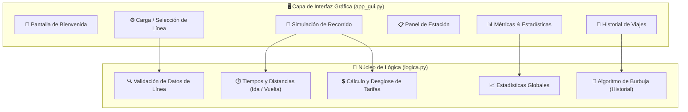

<div align="center">

# 🚆 RailBoard — Simulador Ferroviario

[](https://github.com/Matydesousa/simulador-ferroviario/actions/workflows/python.yml)
[](https://www.python.org/)
[](app_gui.py)
[-brightgreen?style=flat-square)](tests/)
[](LICENSE)

---

Aplicación de escritorio interactiva desarrollada en Python para simular paneles informativos, recorridos, tiempos estimados, tarifas y estadísticas de una red ferroviaria.

</div>

## 📌 Descripción

El proyecto nació como trabajo final para la materia **Introducción a la Programación**. Esta versión conserva la lógica original de cálculo, el flujo de operaciones y el algoritmo clásico de **ordenamiento por burbuja**, sustituyendo la consola de comandos por una interfaz de escritorio limpia e intuitiva en **Tkinter**.

---

## 🚀 Arquitectura y Componentes



---

## ✨ Funcionalidades Destacadas

| Característica | Detalle |
| :--- | :--- |
| **⚙️ Configuración Guiada** | Carga manual de estaciones, distancias y velocidad media, con validación de datos en tiempo real. |
| **🚉 Línea San Martín Precargada** | Configuración de ejemplo con 15 estaciones y distancias parametrizadas para pruebas inmediatas. |
| **↔️ Simulación Bidireccional** | Cálculo de itinerarios y tiempos estimados tanto en sentido directo (*ida*) como inverso (*vuelta*). |
| **📋 Panel de Estación Dinámico** | Carteles secuenciales interactivos con opción de avance manual paso a paso o reproducción automática. |
| **💲 Tarifas Paramétricas** | Algoritmo de costos basado en precio base fijo más tarifa incremental por kilómetro recorrido. |
| **📈 Métricas de la Línea** | Cálculo de longitud total, distancia promedio entre paradas, tramos extremos y tiempos globales. |
| **🔄 Historial Ordenado** | Registro de simulaciones con ordenamiento cronológico o por distancia mediante el algoritmo de burbuja original. |

---

## 🛠️ Tecnologías

- **Python 3.10+ / 3.13**: Tipado estático con `typing`, modularización y manejo de excepciones.
- **Tkinter & TTK**: Widgets de interfaz nativos, temas y gestión de ventanas multiplataforma.
- **Unittest**: Suite de pruebas unitarias y pruebas de humo (*smoke tests*) de la interfaz gráfica.
- **GitHub Actions & Xvfb**: Integración continua automatizada con servidor gráfico virtual para entornos headless de Linux.

> **Zero Dependencies**: Utiliza exclusivamente la biblioteca estándar de Python sin requerir instalación de paquetes vía `pip`.

---

## 💻 Ejecución

Desde la terminal o consola de comandos en la carpeta del proyecto:

```powershell
# En Windows (Python Launcher)
py -3 main.py

# En Linux / macOS
python3 main.py
```

---

## 🧪 Pruebas Automatizadas

La suite de pruebas cubre validaciones de datos, cálculos tarifarios, algoritmos de ordenamiento y renderizado de vistas:

```powershell
# Ejecutar todas las pruebas unitarias con reporte detallado
py -3 -m unittest discover -s tests -v
```

---

## 📂 Estructura del Repositorio

```text
simulador-ferroviario/
├── .github/
│   └── workflows/
│       └── python.yml       # Integración continua con servidor Xvfb
├── tests/
│   ├── test_simulador.py   # Pruebas unitarias de cálculo y lógica
│   └── test_gui_smoke.py   # Pruebas de integración de la interfaz Tkinter
├── main.py                  # Punto de entrada de la aplicación
├── app_gui.py               # Interfaz gráfica y gestor de pantallas
├── logica.py                # Algoritmos de recorrido, tarifas y ordenamiento
├── LICENSE                  # Licencia MIT
└── README.md                # Documentación del proyecto
```

---

## 👤 Autor

Desarrollado por **[Matías Joaquín De Sousa](https://github.com/Matydesousa)** como proyecto final de Introducción a la Programación.

---

## 📄 Licencia

Este proyecto se distribuye bajo la licencia **[MIT](LICENSE)**.
